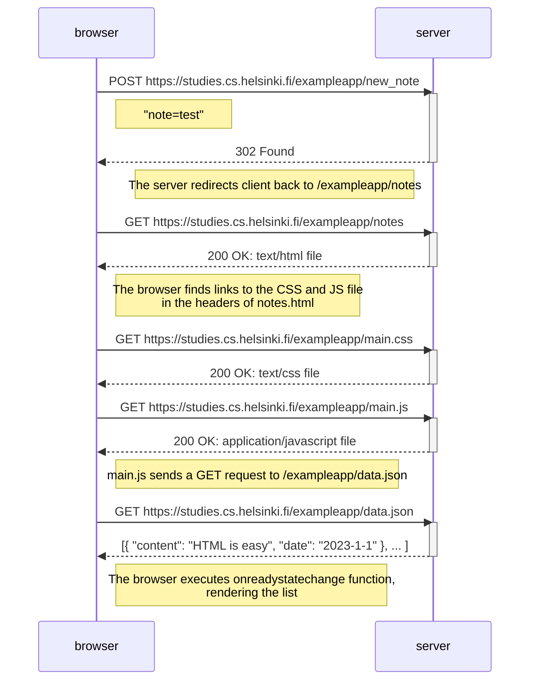

```mermaid
sequenceDiagram
    participant browser
    participant server

    browser->>server: POST https://studies.cs.helsinki.fi/exampleapp/new_note
    activate server
    Note right of browser: "note=test"
    server-->>browser: 302 Found
    deactivate server
    Note left of server: The server redirects client back to /exampleapp/notes 

    browser->>server: GET https://studies.cs.helsinki.fi/exampleapp/notes
    activate server
    server-->>browser: 200 OK: text/html file
    deactivate server
    Note right of browser: The browser finds links to the CSS and JS file <br> in the headers of notes.html

    browser->>server: GET https://studies.cs.helsinki.fi/exampleapp/main.css
    activate server
    server-->>browser: 200 OK: text/css file
    deactivate server

    browser->>server: GET https://studies.cs.helsinki.fi/exampleapp/main.js
    activate server
    server-->>browser: 200 OK: application/javascript file
    deactivate server

    Note right of browser: main.js sends a GET request to /exampleapp/data.json

    browser->>server: GET https://studies.cs.helsinki.fi/exampleapp/data.json
    activate server
    server-->>browser: [{ "content": "HTML is easy", "date": "2023-1-1" }, ... ]
    deactivate server

    Note right of browser: The browser executes onreadystatechange function, <br> rendering the list
```