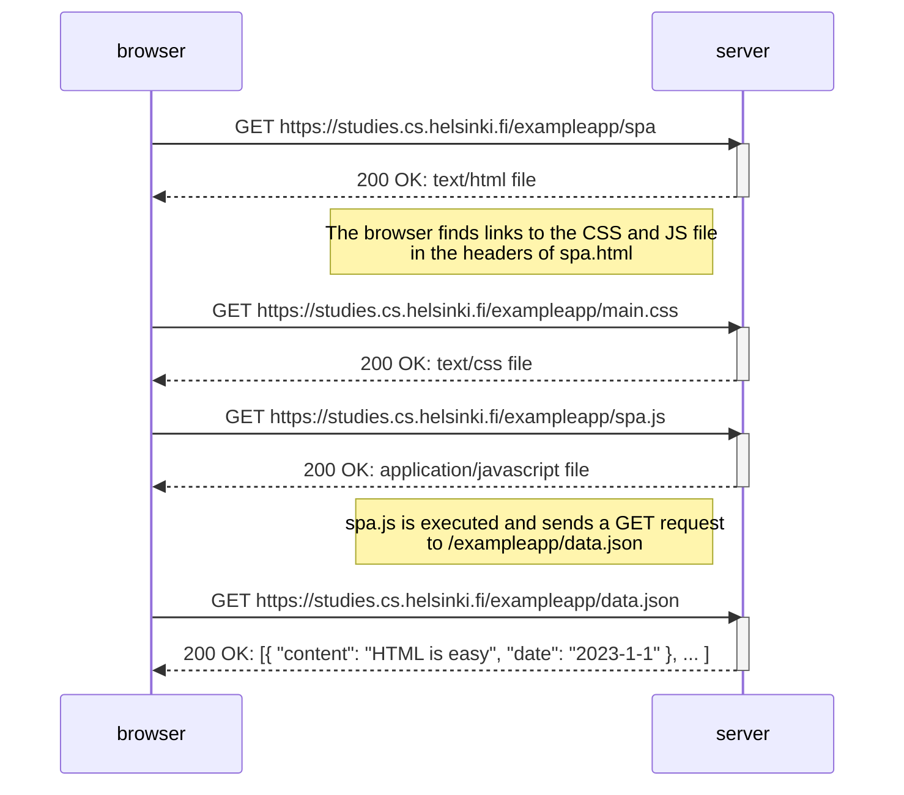

```mermaid
sequenceDiagram
    participant browser
    participant server

    browser->>server: GET https://studies.cs.helsinki.fi/exampleapp/spa
    activate server
    server-->>browser: 200 OK: text/html file
    deactivate server

    Note left of server: The browser finds links to the CSS and JS file <br> in the headers of spa.html

    browser->>server: GET https://studies.cs.helsinki.fi/exampleapp/main.css
    activate server
    server-->>browser: 200 OK: text/css file
    deactivate server

    browser->>server: GET https://studies.cs.helsinki.fi/exampleapp/spa.js
    activate server
    server-->>browser: 200 OK: application/javascript file
    deactivate server

    Note left of server: spa.js is executed and sends a GET request <br> to /exampleapp/data.json

    browser->>server: GET https://studies.cs.helsinki.fi/exampleapp/data.json
    activate server
    server-->>browser: 200 OK: [{ "content": "HTML is easy", "date": "2023-1-1" }, ... ]
    deactivate server
```