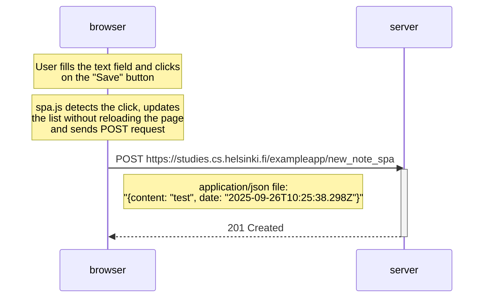

```mermaid
sequenceDiagram
    participant browser
    participant server

    Note over browser: User fills the text field and clicks <br> on the "Save" button

    Note over browser: spa.js detects the click, updates <br> the list without reloading the page <br> and sends POST  request

    browser->>server: POST https://studies.cs.helsinki.fi/exampleapp/new_note_spa
    activate server
    Note right of browser: application/json file: <br> "{content: "test", date: "2025-09-26T10:25:38.298Z"}"
    server-->>browser: 201 Created
    deactivate server
```